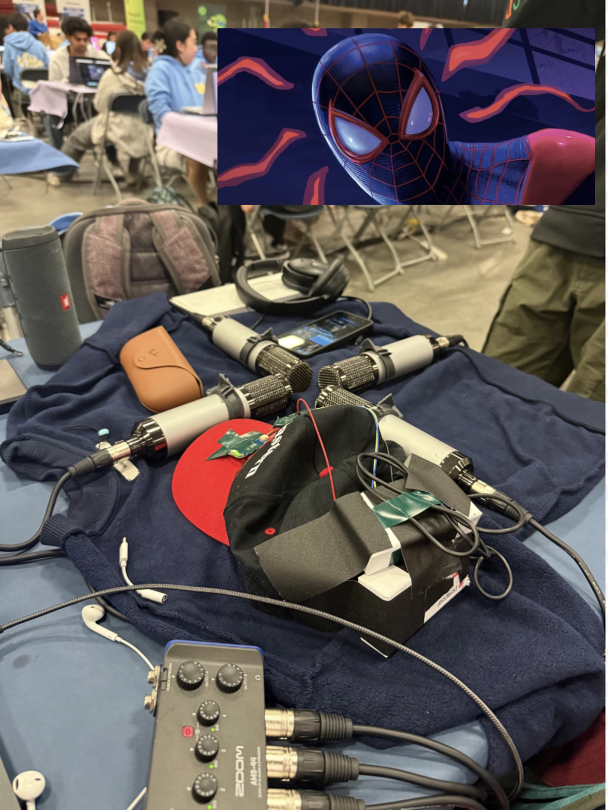

# Spidey Sense

> [!TIP]
> ## 🥇 **We won the Healthcare track at HackMIT 2026!!**
> HackMIT is one of the most prestigious collegiate hackathons, and hundreds of teams competed! This is our second year winning a main track.

Directional noise cancelling with a four-microphone array. Point it at one person and you
hear only them; everything else in the room is suppressed. Direction comes from wherever
you're looking, from a click on a live map of the room, or from the array's own tracking of
who is talking. Alarms, bangs and shouted danger words switch the cancelling off so you are
never sealed in.

It runs on a laptop with a cheap 4-channel USB audio interface and four microphones. No cloud,
no account, no GPU.



## How it works

Sound reaches each of the four mics at a slightly different time. From those phase
differences the software computes a bearing for every sound in the room (SRP-PHAT, 21 times a
second, 360°). To listen in one direction it forms a beam: an MVDR beamformer places nulls on
the loudest interferers, then a per-frequency-bin direction mask keeps only the energy that
arrived from the target bearing. Speech is sparse in time-frequency, so this separates far
beyond what four mics can do with a linear beamformer. An optional DeepFilterNet3 stage cleans
up the mask's artefacts.

Measured on a 12 cm diamond of cardioid vocal mics, two voices 215° apart:
single mic −0.6 dB → MVDR 2.1 dB → mask 10.3 dB → mask + DeepFilterNet 18.3 dB SIR.

## Hardware

- Four microphones in a diamond, roughly 10–15 cm across. Cheap cardioid vocal mics work. Get the bodies off
  the table or dampened — structure-borne sound arrives before the air path and corrupts every delay.
- A 4-input audio interface. Developed on a Zoom AMS-44; anything CoreAudio/PortAudio sees as
  one 4-channel device works. Set `SPIDEY_DEVICE` to a substring of its name.
- Wired earbuds or headphones. Bluetooth adds 150–300 ms and reads as broken.
- Optionally, a head tracker. Anything that can report a heading (see *Gaze*).

## Install

```sh
python3 -m venv .venv && .venv/bin/pip install -r requirements.txt
```

Python 3.11+ (3.14 works). The Whisper model (~480 MB) downloads the first time `listen.py` runs.

For the DeepFilterNet stage, build the Rust shim once (needs `cargo`):

```sh
cd tools/df-stream && cargo build --release
```

Without it everything runs; the **NN repair** button just stays off.

## Calibrate the array

Mic positions matter to the millimetre, and a ruler is not good enough. Put a speaker at six to
ten spots around the array and let the tool measure the geometry from the delays:

```sh
python3 calibration/calibrate.py add 0      # speaker roughly north
python3 calibration/calibrate.py add 45     # ... repeat around the circle
python3 calibration/calibrate.py solve --write
```

`solve` fits the mic positions and writes `calibration/mics.json`, which `spideysense.py` loads on
start. Until that file exists a nominal diamond of `SPIDEY_ARRAY_M` (default 0.12 m) is used.
`calibration/wavefront.py <bearing>` checks whether the array is seeing a real plane wave or just
reverb — useful when the map looks wrong and you don't know if it's the room or the code.

## Run

```sh
source .venv/bin/activate
python3 beam.py                 # array in -> earbuds out; control API on :8766
python3 webui/webui.py          # room view at http://127.0.0.1:8765
python3 listen.py               # optional: transcript with bearings -> webui
python3 gaze/gyrohat.py         # optional: a gaze source -> webui (or your own, see below)
```

`./run.sh` starts the first three with logs in `logs/`; `./run.sh stop` kills them.
`./run.sh sim` runs the room view with no hardware: two synthetic talkers, a sweeping gaze and an
alarm at 20 s, so you can see the page before building anything.

## The page

| | |
|---|---|
| Green lobe and dot | Where sound is coming from now. The bearing is tracked: it glides while the same talker keeps speaking and only jumps to a new one after ~150 ms at 6 dB above the floor, so word gaps and reverb tails don't make it wander |
| Amber arrow | Where you're looking, drawn from your seat (see *Gaze*) |
| Blue wedge | Where the beam is listening. Click anywhere on the room to steer it; **F** makes it follow your gaze |
| Mask / MVDR / DS / Off | Beamformer mode. Mask is the product; MVDR and DS are there to A/B against |
| NN repair | DeepFilterNet3 after the mask, if `tools/df-stream` is built |
| Room / in your ears | Level in the room vs level reaching your earbuds. The gap is the cancelling |
| Red room | An alarm was heard: cancelling forced OFF until 8 s after it stops. **Test alarm** (**A**) runs the same path without a real alarm |
| Bangs | Also break in on a single sharp bang (shot, glass, clap). Off by default because applause is a bang too |
| Alarm meter and `detector:` line | Why the alarm is or isn't firing: the sound must be **loud**, **tonal** and **steady**, and the bar must fill (~1 s of a steady alarm, up to ~5 s of a 50 %-duty beeper) |
| Transcript | What was said, tagged with its bearing. Blue = you were facing it, grey = you missed it. Needs `listen.py` |
| Highlighted line | Someone you were *not* facing said your name. The beam ducks 12 dB for 3 s |
| Danger words | "Fire!", "get out", "call 911", "shooter" in the transcript break in like an alarm. Casual uses ("that talk was fire") don't. About 1 s behind the speech |
| Bottom strip | Bearing over time. White = tracked bearing, amber = gaze, blue = listening, dots = utterances, ticks = alerts |
| **M** Mute | Pause the transcript while you talk, so your own voice doesn't land in it |

North is at 12 o'clock. **R** re-zeros the gaze: face North and press it.

Set your name for the name alert by clicking the amber name under *Transcript*, or with
`SPIDEY_NAME=Sam,Sammy` (aliases comma-separated). It's remembered in `me.txt`.

## Gaze

The room view doesn't know what tracks your head. Anything that can POST
`{"yaw": <degrees>}` to `http://127.0.0.1:8765/gaze` is a gaze source: an IMU on a hat, a phone's
compass, a webcam head-pose model. Yaw is clockwise with any zero; re-zero takes the yaw arriving
at that moment as North. Post `{"connected": false}`, or stop posting for 2 s, and the page shows
*No gaze* and keeps the last heading. Set `YAW_SIGN = -1` in `webui.py` if the arrow turns the
wrong way.

`gaze/gyrohat.py` is a reference source: an ESP32-S3 with an LSM6DSOX IMU streaming JSON over
UDP, forwarded in 40 lines. Copy it for your own tracker.

The wearer is not at the array, so the gaze ray is intersected with each sound source's ray
from the array; the beam steers at the array bearing of whatever you're actually looking at.
`HAT_POS` in `webui.py` is where you sit relative to the array, in metres.

## Configuration

Environment: `SPIDEY_DEVICE` (audio interface name), `SPIDEY_ARRAY_M` (nominal array size
until calibrated), `SPIDEY_NAME`, `SPIDEY_WHISPER` (`base.en` is 3× faster than `small.en` but
worse with names), `BEAM_FS`.

Top of `webui/webui.py`: `ACTIVE_DB` (what counts as sound), `SNAP_DEG`/`SNAP_FRAMES` (tracker),
`HAZ_LOUD`/`HAZ_TONAL`/`HAZ_TRIG` (alarm sensitivity, also live via `/haz?loud=6&trig=16`),
`NAME_OFF_GAZE`, `DUCK_DB`, `HAT_POS`.

Top of `beam.py`: `MASK_*` (mask width, ramp, floor, smoothing; also live via `/cfg`), `LOAD`
(MVDR diagonal loading), `NN_ATTEN` (cap on how much DeepFilterNet may remove; unlimited eats
quiet reverberant speech).

## HTTP API

`beam.py` on :8766 — `/steer?az=270`, `/mode?m=off|ds|mvdr|mask`, `/gain?db=20`,
`/follow?on=1` (steer where the gaze looks), `/track?on=1` (steer at the tracked talker),
`/nn?on=1`, `/load?x=0.5`, `/cfg?width=50&ramp=40&floor=0.1&smooth=0.6&post=0.5&dsmooth=0.1`,
`/rec?on=1` … `/rec?on=0` (writes `rec/<stamp>_in.wav`, the raw 4 channels, and `_out.wav`, what
you heard), `/state`.

`webui.py` on :8765 — everything above is proxied, plus `POST /gaze`, `POST /utterance`
(`{"t0","t1","text"}`, what `listen.py` sends), `/rezero`, `/hazard` (test break-in), `/haz`
(read or tune the detector), `/mute?on=1`, `/me?name=`, `/recent?secs=30` (transcript as JSON),
`/stream` (server-sent events: frames, gaze, beam state, utterances, alerts).

## Layout

- `spideysense.py` — array geometry, capture, SRP-PHAT. Everything else imports it.
- `beam.py` — the beamformer and the audio path to your ears.
- `webui/` — `webui.py` (tracker, hazard and bang detectors, name and danger-word alerts, SSE) and `index.html` (the page; d3 and fonts vendored, works offline).
- `listen.py` — energy VAD + faster-whisper, posts utterances to the room view.
- `gaze/` — gaze sources.
- `calibration/` — `calibrate.py` (geometry from sound), `wavefront.py` (plane-wave check).
- `tools/df-stream/` — DeepFilterNet3 as a stdin→stdout filter, 480-sample hops, ~40 ms.
- `hear.py` — meter and monitor individual mics; for checking wiring.

## Limits

Four mics give you nulls, not a narrow beam: real-room rejection from MVDR alone is 3–5 dB
because of reverb; the mask is what gets to 10–18 dB. Direction finding is only unambiguous
below the spatial-alias limit (~1.4 kHz on a 12 cm array). Reverb is the ceiling on everything.
Gyro-only yaw drifts; re-zero often or use a source with a magnetometer.

* Commit history was overwritten for privacy of recorded test files
